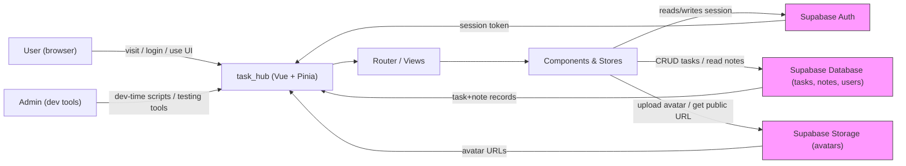

## task_hub — Context Diagram

This document describes the high-level context diagram for the task_hub application. It shows primary actors, the main system (the Vue app), and external services it interacts with (Supabase Auth, Database, and Storage). Use the Mermaid section to render a diagram in editors that support Mermaid (GitHub, VS Code + Mermaid plugin).

### Mermaid diagram

### ASCII fallback (if Mermaid can't render)

Actors:

- User (browser)
- Admin (developer testing tools)

System:

- task_hub (Vue 3 app, Pinia stores, Router)

External services:

- Supabase Auth (sign up, sign in, sessions)
- Supabase Database (tables: tasks, notes, users)
- Supabase Storage (avatars bucket)

Data flows (high level):

1. User opens app (static assets served by dev server / build)
2. User logs in / signs up via Supabase Auth. The app stores/reads the session and redirects routes using router guards (`src/router/index.js`).
3. Authenticated app calls Supabase Database to fetch tasks and notes via the Pinia stores (`src/stores/taskStore.js`).
4. The app performs CRUD on `tasks` (create/edit/delete). Notes are created/updated in the `notes` table. Files (avatars) are uploaded to Supabase Storage.
5. Admin/dev tools (e.g., `utils/loginAttemptsAdmin.js`) can be loaded in development for testing and debugging.

### Mapping to repository files

- App entry: `src/main.js`, `src/App.vue`
- Router & navigation: `src/router/index.js`, route views in `src/views/` and components in `src/components/`
- Supabase client & helpers: `src/utils/supabase.js`
- Stores handling data flows: `src/stores/taskStore.js`, `src/stores/authUser.js`
- UI for auth: `src/components/auth/*`, views in `src/views/auth/*`

### Legend / Notes

- Arrows indicate primary direction of requests/flows.
- Supabase is an external BaaS providing Auth, Database (Postgres), and Storage.
- The Vue app is the system boundary. Everything inside (router, components, stores) is part of the application.

### Next steps / export

- To export a PNG of the Mermaid diagram in VS Code: install the "Markdown Preview Enhanced" or "Mermaid Markdown Syntax Highlighting" extension and use the preview's export feature.
- If you want a different diagram style (C4, UML), tell me which and I can produce it.

### Completion

File created to provide a context diagram and mapping. If you'd like, I can also:

- Generate a PNG/SVG from the Mermaid diagram and add it to `public/`.
- Embed the diagram into `README.md`.
